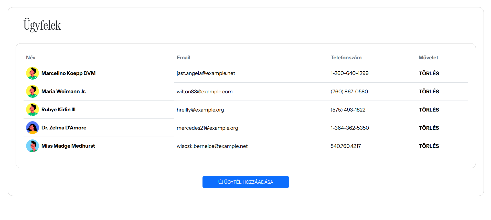
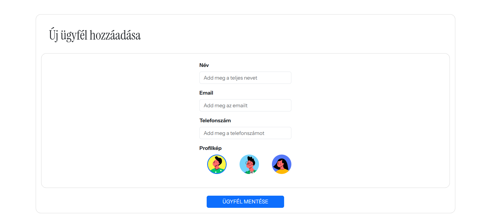
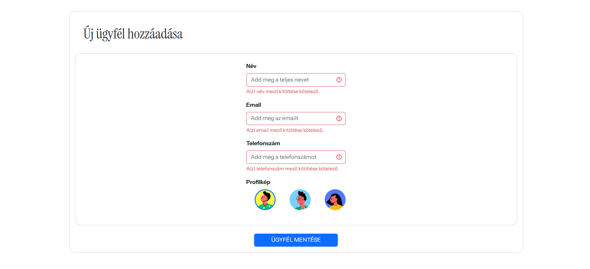

# Próbafeladat Voov 2025

Laravel 12 használva (Előkövetelménye: PHP 8.2+)

Telepítés után a megszokott parancsokkal elindítható:
```
php artisan serve
npm run dev
```


- env létrehozása:
```
copy .env.example .env
```

- Migráció lefuttatása után seeder-rel pár minta ügyfelet előre betölthetünk:
```
php artisan db:seed
```

Több idő esetén pl. a következőket csinálnám másképp:
- avatart ügyfél is feltölthetne
- felhasználókezelés
- jogosultságkezelés
- ügyfelekkel kapcsolatos adatok tárolása, számlák, stb.


Elkészült alkalmazásról képrészletek:





